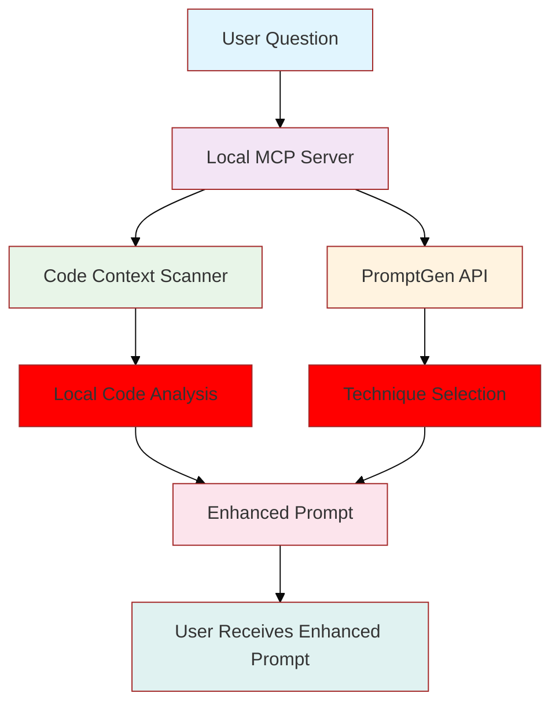
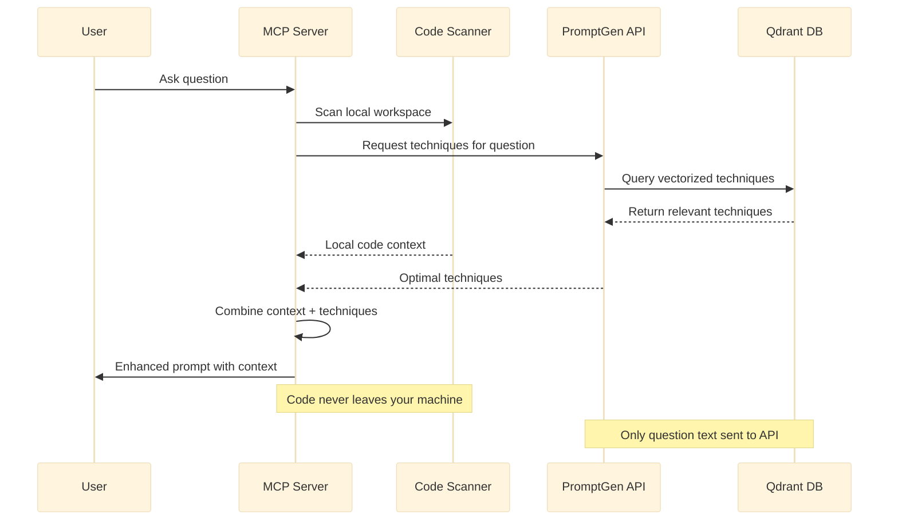

# PromptGen MCP - Local Server

Transform simple questions into comprehensive, context-aware prompts using advanced prompt engineering techniques fetched from PromptGen API and your local code context.

## 🚀 Quick Start

### **1. Get Your PromptGen API Key**
1. Visit: https://promptgen-mcp.replit.app (or your deployed website URL)
2. Sign up and generate your API key
3. Copy your API key starting with `pg_sk_`

### **2. Get Other Required API Keys**
- **GROQ API Key**: Get from https://console.groq.com/
- **Tavily API Key**: Get from https://tavily.com/

### **3. Install Dependencies**
```bash
# Navigate to the directory
cd prompt-gen-mcp

# Install dependencies
pip install mcp sentence-transformers httpx groq
```

### **4. Configure Cursor**
Copy the configuration to your Cursor MCP settings file (`~/.cursor/mcp_servers.json`):

```json
{
  "mcpServers": {
    "prompt-gen": {
      "command": "python",
      "args": ["/full/path/to/prompt-gen-mcp/src/prompt_gen_mcp/server.py"],
      "env": {
        "PROMPTGEN_API_KEY": "pg_sk_your_key_here",
        "GROQ_API_KEY": "gsk_your_groq_key_here", 
        "TAVILY_API_KEY": "tvly_your_tavily_key_here"
      }
    }
  }
}
```

**Important**: Replace `/full/path/to/prompt-gen-mcp/` with the actual full path to this directory.

### **5. Restart Cursor**
Completely restart Cursor (not just reload) for the MCP server to be recognized.

### **6. Start Using**
1. Open any project in Cursor
2. Press `Cmd+Shift+P` (Mac) or `Ctrl+Shift+P` (Windows/Linux)
3. Type: "MCP: enhance_prompt"
4. Ask: "How do I optimize this React component?"

## 💡 What You Get

### 🔄 Transformation Example

| **Before** | **After** |
|------------|----------|
| `"How do I optimize this React component?"` | **Comprehensive Enhanced Prompt** |

**Enhanced Output:**
```markdown
# 🚀 Enhanced Prompt for: How do I optimize this React component?

## 🔍 Question Analysis
- **Types**: optimization, implementation  
- **Complexity**: medium
- **Domain**: frontend
- **Intent**: optimize performance

## 🎯 Selected Prompt Engineering Techniques

### 1. 📋 Plan and Solve (Score: 0.847)
**Description**: Break down complex problems into structured planning and systematic solving phases

**Application**: Plan: Identify optimization targets. Solve: Apply specific React patterns.

### 2. 📚 Few-Shot Learning (Score: 0.823)
**Description**: Provide examples to guide the response

**Application**: Here are optimization examples: useMemo, React.memo, useCallback...

## 📁 Relevant Code Context

### File 1: `src/components/UserProfile.tsx` (Relevance: 0.892)
```typescript
const UserProfile = ({ userId }) => {
  const [user, setUser] = useState(null);
  useEffect(() => {
    fetchUser(userId).then(setUser);
  }, [userId]);
  return <div>{user?.name}</div>;
};
```

## ✨ Enhanced Analysis Request
[Structured instructions for comprehensive response with context-aware suggestions...]
```

### 📊 Feature Comparison

| Feature | Basic Prompt | Enhanced Prompt |
|---------|-------------|----------------|
| **Context Awareness** | ❌ None | ✅ Full codebase context |
| **Technique Selection** | ❌ Manual | ✅ AI-powered optimal selection |
| **Privacy** | ⚠️ Varies | ✅ Code stays local |
| **Structured Output** | ❌ Basic | ✅ Comprehensive analysis |
| **Code Examples** | ❌ Generic | ✅ From your actual project |
| **Relevance Scoring** | ❌ None | ✅ Semantic similarity matching |

## 🔒 Architecture & Privacy

- **🏠 Local Processing**: All code scanning happens on your machine
- **🌐 API Integration**: Only technique selection uses PromptGen API
- **🔢 No Code Shared**: Your code never leaves your machine
- **🎯 Smart Selection**: AI chooses optimal techniques from hosted database
- **📁 Context Aware**: Automatically includes relevant code from your project

## ⚙️ How It Works

### Architecture Overview



### Interaction Flow



**Privacy-First Flow:**
1. **Local MCP** scans your code privately on your machine
2. **PromptGen API** provides optimal techniques from hosted Qdrant database
3. **Local processing** combines everything into enhanced prompt
4. **No code leaves** your machine - only question text sent to get techniques

## 🎯 Use Cases

- **Code Optimization**: Get structured analysis with relevant code context
- **Architecture Decisions**: Receive comprehensive comparisons with examples  
- **Debugging Help**: Get systematic debugging approaches with code snippets
- **Learning**: Understand concepts with examples from your actual codebase

## 🔧 Troubleshooting

**MCP Server Not Working:**
```bash
# Test the server directly
python src/prompt_gen_mcp/server.py

# Check dependencies
pip install mcp sentence-transformers httpx groq
```

**API Key Issues:**
- Ensure `PROMPTGEN_API_KEY` starts with `pg_sk_`
- Get valid GROQ key from https://console.groq.com/
- Get valid Tavily key from https://tavily.com/

**Cursor Not Finding MCP:**
- Ensure complete Cursor restart (not just reload)
- Check `~/.cursor/mcp_servers.json` syntax
- Verify file paths are absolute
- Look for MCP status in Cursor's bottom status bar

**No Code Context:**
- Ensure you're in a project directory
- Check file permissions
- Verify supported file types (.py, .js, .ts, .tsx, .jsx, .md, .txt)

## 📊 Features

- ✅ **PromptGen API Integration** (hosted technique database)
- ✅ **Local Code Context Scanning** (100% private)
- ✅ **Privacy-Preserving Architecture**
- ✅ **Intelligent Technique Selection**
- ✅ **LLM-Powered Question Analysis**
- ✅ **True MCP Architecture** (self-contained)
- ✅ **Fallback Support** (works offline)

## 🏗️ Architecture Benefits

**Proper MCP Design:**
- ✅ Single self-contained server process
- ✅ Cursor manages server lifecycle automatically  
- ✅ No manual background service management
- ✅ Clean startup/shutdown with Cursor

**API Integration:**
- ✅ Uses PromptGen API for techniques (no local llms.txt)
- ✅ Hosted Qdrant database with vectorized techniques
- ✅ User authentication via API keys
- ✅ Usage tracking and billing support

## 🤝 Contributing

1. Fork the repository
2. Create your feature branch
3. Commit your changes  
4. Push to the branch
5. Create a Pull Request

## 📄 License

MIT License - see LICENSE file for details.