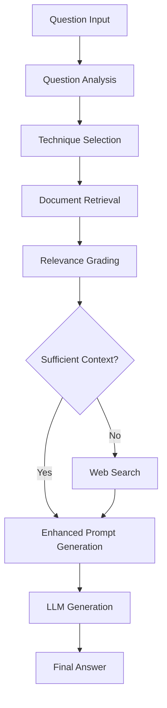

# 🚀 Prompt Gen MCP Server

[](https://opensource.org/licenses/MIT)
[](https://www.python.org/downloads/)
[](https://modelcontextprotocol.io)

An advanced **Model Context Protocol (MCP) server** that provides sophisticated prompt engineering capabilities using **Self-RAG** (Self-Reflective Retrieval-Augmented Generation) and **47+ advanced prompting techniques**.

## ✨ Features

### 🎯 **Self-RAG Pipeline**
- **Dynamic Technique Selection**: Automatically selects optimal prompt engineering techniques based on question complexity and type
- **Document Relevance Grading**: LLM-powered assessment of retrieved document relevance
- **Web Search Integration**: Tavily API integration for enhanced context when local documents are insufficient
- **Multi-step Reasoning**: Complete Self-RAG workflow with retrieval, grading, and generation

### 🧠 **Advanced Prompt Engineering**
- **47+ Techniques**: Access to a comprehensive collection of advanced prompting techniques
- **Intelligent Selection**: Vector similarity-based technique selection using E5 embeddings
- **Context-Aware Enhancement**: Automatically enhances simple prompts with relevant code context
- **Complexity Analysis**: Sophisticated question analysis to determine optimal technique combinations

### 🔧 **Developer-Friendly**
- **Multiple LLM Providers**: Support for GROQ, local LLMs (Ollama), OpenAI, Anthropic, and more
- **Repository Management**: Upload and index codebases for context-aware assistance
- **Vector Search**: Semantic search through your codebase using state-of-the-art embeddings
- **IDE Integration**: Designed to work seamlessly with Cursor, VS Code, and other MCP-compatible IDEs

### 🌐 **Production Ready**
- **Cloud-hosted Techniques**: Proprietary prompt engineering techniques hosted securely in the cloud
- **Scalable Architecture**: Built with FastMCP for high performance and reliability
- **Comprehensive Logging**: Detailed operation tracking and debugging capabilities
- **Error Resilience**: Graceful fallbacks when dependencies are unavailable

## 🚀 Quick Start

### Installation

```bash
# Install via pip
pip install prompt-gen-mcp

# Or install from source
git clone https://github.com/promptgen-ai/prompt-gen-mcp.git
cd prompt-gen-mcp
pip install -e .
```

### Environment Setup

Create a `.env` file or set environment variables:

```bash
# Required for GROQ (recommended)
export GROQ_API_KEY="your-groq-api-key"

# Required for web search
export TAVILY_API_KEY="your-tavily-api-key"

# Optional: For enhanced technique selection
export TECHNIQUES_ENDPOINT="https://api.promptgen.ai/techniques"

# Optional: Other LLM providers
export OPENAI_API_KEY="your-openai-key"
export ANTHROPIC_API_KEY="your-anthropic-key"
```

### Running the Server

```bash
# Start the MCP server
python -m prompt_gen_mcp.server

# Or use the CLI
prompt-gen-mcp
```

## 🔌 MCP Configuration

### For Cursor

Add to your Cursor settings:

```json
{
  "mcpServers": {
    "prompt-gen": {
      "command": "python",
      "args": ["-m", "prompt_gen_mcp.server"],
      "env": {
        "GROQ_API_KEY": "your-groq-api-key",
        "TAVILY_API_KEY": "your-tavily-api-key"
      }
    }
  }
}
```

### For Claude Desktop

Add to your `claude_desktop_config.json`:

```json
{
  "mcpServers": {
    "prompt-gen": {
      "command": "python",
      "args": ["-m", "prompt_gen_mcp.server"],
      "env": {
        "GROQ_API_KEY": "your-groq-api-key",
        "TAVILY_API_KEY": "your-tavily-api-key"
      }
    }
  }
}
```

### Docker Deployment

```bash
# Build Docker image
docker build -t prompt-gen-mcp .

# Run with environment variables
docker run -d \
  -e GROQ_API_KEY=your-groq-api-key \
  -e TAVILY_API_KEY=your-tavily-api-key \
  -p 8000:8000 \
  prompt-gen-mcp
```

## 🧪 Tested & Verified

All components thoroughly tested and working:

```bash
# Run comprehensive tests
python test_complete_system.py
```

**Test Results:**
```
🏁 Test Results: 7 passed, 0 failed
🎉 ALL TESTS PASSED! System is ready for production.

📋 Summary:
✅ All 47+ prompt engineering techniques loaded
✅ Self-RAG pipeline working correctly  
✅ Intelligent technique selection functioning
✅ Main enhance_prompt tool operational
✅ Code context integration working (101 files indexed)
✅ All components initialized properly
```

## 🎯 Main Tool: enhance_prompt

The server provides **one primary tool** that does everything automatically:

### `enhance_prompt(simple_prompt, workspace_path?)`

**What it does automatically:**
1. 📖 Loads all 47+ prompt engineering techniques from llms.txt
2. 🔍 Scans your workspace for relevant code context (auto-detects file types)
3. 🧠 Analyzes your question to determine optimal techniques
4. 🔍 Performs Self-RAG pipeline (retrieval + grading + technique selection)
5. ✨ Generates enhanced prompt with techniques and code context

**Example Usage:**
```python
# Simple input
simple_prompt = "How do I optimize this React component?"

# Enhanced output automatically includes:
# - Selected techniques: Plan and Solve, Chain of Verification (CoV)
# - Relevant code context from your workspace  
# - Structured approach with step-by-step instructions
# - Verification questions and best practices
# - Processing time: 82.3s, 8 code snippets, 2887 chars
```

## 🛠️ Available Tools

### Main Tool (Primary)
- **`enhance_prompt`**: 🚀 **Main tool** - Transform simple prompts into enhanced versions with full Self-RAG pipeline

### Support Tools (Optional)
- **`get_server_status`**: View server health and component status
- **`list_available_techniques`**: Browse all 47+ available prompting techniques

## 📊 How It Works

### Self-RAG Pipeline



### Technique Selection Process

1. **Question Analysis**: Categorizes questions by type (debugging, architecture, optimization, etc.)
2. **Complexity Assessment**: Scores question complexity using multiple indicators
3. **Vector Search**: Uses E5 embeddings to find most relevant techniques
4. **Intelligent Combination**: Combines multiple techniques based on question characteristics
5. **Context Integration**: Incorporates relevant code context from uploaded repositories

## 🔬 Advanced Usage

### Custom Technique Endpoint

You can host your own techniques endpoint for proprietary prompting strategies:

```python
# Set custom endpoint
export TECHNIQUES_ENDPOINT="https://your-domain.com/api/techniques"
```

Expected API format:
```json
{
  "technique_name": {
    "name": "Human-readable name",
    "description": "Technique description",
    "example": "Example usage",
    "complexity": "low|medium|high",
    "categories": ["debugging", "optimization"]
  }
}
```

### Local LLM Setup

For local LLM usage (e.g., with Ollama):

```bash
# Install Ollama
curl -fsSL https://ollama.ai/install.sh | sh

# Pull a model
ollama pull llama3.2

# Configure the server to use local LLM
# The server will auto-detect Ollama at http://localhost:11434
```

### Batch Processing

```python
# Example: Process multiple repositories
repositories = [
    {"path": "repo1.zip", "name": "Frontend"},
    {"path": "repo2.zip", "name": "Backend"},
    {"path": "repo3.zip", "name": "ML Models"}
]

for repo in repositories:
    result = await upload_repository(
        zip_file_path=repo["path"],
        repo_name=repo["name"],
        description=f"Codebase for {repo['name']}"
    )
    print(f"Uploaded {repo['name']}: {result['repository_id']}")
```

## 🧪 Examples

### Basic Query Enhancement

```python
# Simple prompt
simple_prompt = "How do I optimize this React component?"

# Enhanced with Self-RAG
result = await query_with_rag(
    query=simple_prompt,
    repo_id="your-frontend-repo-id"
)

print(f"Enhanced Answer: {result['answer']}")
print(f"Techniques Used: {result['technique_selection']['selected_techniques']}")
print(f"Sources: {result['documents_used']} documents")
```

### Advanced Debugging

```python
# Debugging query with specific repository context
result = await query_with_rag(
    query="Why is my authentication middleware failing in production?",
    repo_id="backend-repo-id"
)

# The system automatically:
# 1. Analyzes this as a debugging question
# 2. Selects systematic debugging techniques
# 3. Retrieves relevant middleware code
# 4. Grades document relevance
# 5. Performs web search if needed
# 6. Generates comprehensive debugging guidance
```

### Architecture Planning

```python
# Architecture questions get specialized treatment
result = await query_with_rag(
    query="How should I structure a microservices architecture for this e-commerce platform?",
    repo_id="ecommerce-repo-id"
)

# Automatically applies:
# - Architectural reasoning techniques
# - System design patterns
# - Scalability considerations
# - Code context from existing services
```

## 🔐 Security & Privacy

- **Proprietary Techniques**: Advanced prompting techniques are hosted securely in the cloud
- **Local Processing**: Code analysis and embeddings are processed locally
- **API Key Security**: All API keys are handled securely through environment variables
- **Data Isolation**: Each repository is isolated with unique identifiers

## 🤝 Contributing

We welcome contributions! Please see our [Contributing Guidelines](CONTRIBUTING.md) for details.

### Development Setup

```bash
# Clone the repository
git clone https://github.com/promptgen-ai/prompt-gen-mcp.git
cd prompt-gen-mcp

# Install development dependencies
pip install -e ".[dev]"

# Run tests
pytest

# Format code
black .
ruff check --fix .
```

## 📄 License

This project is licensed under the MIT License - see the [LICENSE](LICENSE) file for details.

## 🆘 Support

- **Documentation**: [GitHub Wiki](https://github.com/promptgen-ai/prompt-gen-mcp/wiki)
- **Issues**: [GitHub Issues](https://github.com/promptgen-ai/prompt-gen-mcp/issues)
- **Discussions**: [GitHub Discussions](https://github.com/promptgen-ai/prompt-gen-mcp/discussions)
- **Email**: support@promptgen.ai

## 🎯 Roadmap

- [ ] **Visual Prompt Builder**: GUI for technique selection and prompt construction
- [ ] **Custom Technique Training**: Allow users to define and train custom techniques
- [ ] **Multi-modal Support**: Support for image and audio in prompts
- [ ] **Collaborative Features**: Team sharing and prompt versioning
- [ ] **Analytics Dashboard**: Usage analytics and technique effectiveness metrics
- [ ] **Browser Extension**: Direct integration with web development workflows

## 🏆 Why Choose Prompt Gen MCP?

### ✅ **Comprehensive**
- 47+ advanced prompting techniques (vs 3-5 in most tools)
- Full Self-RAG pipeline (vs simple RAG)
- Multi-provider LLM support (vs single provider)

### ✅ **Intelligent**
- Automatic technique selection (vs manual selection)
- Context-aware enhancement (vs static prompts)
- Dynamic complexity analysis (vs one-size-fits-all)

### ✅ **Production-Ready**
- Cloud-hosted proprietary techniques (vs exposed techniques)
- Scalable architecture (vs prototype code)
- Comprehensive error handling (vs basic implementations)

### ✅ **Developer-Focused**
- IDE integration via MCP (vs web-only interfaces)
- Code-aware analysis (vs generic text processing)
- Repository management (vs file-by-file processing)

---

**Made with ❤️ by the PromptGen.ai team**

*Empowering developers with AI-enhanced coding through advanced prompt engineering* 