# Security Policy

## 🔒 Security Overview

The `prompt-gen-mcp` project is designed with privacy and security as core principles. This document outlines our security practices and guidelines.

## 🛡️ Privacy-First Architecture

### Local Code Processing
- **✅ All code scanning happens locally** on your machine
- **✅ No source code is ever transmitted** to external APIs
- **✅ Only question text** is sent to PromptGen API for technique selection
- **✅ No code context** leaves your local environment

### Data Flow Security

```mermaid
flowchart TD
    A["🔒 Your Code (Local)"] --> B["🖥️ Local MCP Server"]
    B --> C["📤 Question Text Only"]
    C --> D["🌐 PromptGen API"]
    D --> E["📥 Techniques Only"]
    E --> B
    B --> F["✨ Enhanced Prompt"]
    
    style A fill:#e8f5e8
    style B fill:#f3e5f5
    style D fill:#fff3e0
    style F fill:#fce4ec
    
    classDef secure fill:#e8f5e8,stroke:#4caf50,stroke-width:2px
    classDef api fill:#fff3e0,stroke:#ff9800,stroke-width:2px
    
    class A,B,F secure
    class C,D,E api
```


## 🔑 API Key Security

### Required API Keys
1. **PromptGen API Key** (`pg_sk_...`)
   - Used for: Technique selection from hosted database
   - Scope: Read-only access to prompt engineering techniques
   - Data sent: Question text only (no code)

2. **GROQ API Key** (`gsk_...`)
   - Used for: Question analysis and LLM processing
   - Scope: Text analysis only
   - Data sent: Question text only (no code)

3. **Tavily API Key** (`tvly_...`) - Optional
   - Used for: Web search capabilities (if enabled)
   - Scope: Search queries only
   - Data sent: Search terms only (no code)

### API Key Best Practices

#### ✅ Secure Storage
```bash
# Store in environment variables
export PROMPTGEN_API_KEY="pg_sk_your_key_here"
export GROQ_API_KEY="gsk_your_key_here"
export TAVILY_API_KEY="tvly_your_key_here"
```

#### ✅ Cursor MCP Configuration
```json
{
  "mcpServers": {
    "prompt-gen": {
      "env": {
        "PROMPTGEN_API_KEY": "pg_sk_your_key_here",
        "GROQ_API_KEY": "gsk_your_key_here",
        "TAVILY_API_KEY": "tvly_your_key_here"
      }
    }
  }
}
```

#### ❌ Never Do This
```python
# DON'T hardcode API keys in source code
api_key = "pg_sk_actual_key_here"  # ❌ NEVER

# DON'T commit API keys to version control
# DON'T share API keys in plain text
# DON'T store API keys in configuration files
```

## 🚨 Security Guidelines

### For Users

1. **Environment Variables**
   - Always use environment variables for API keys
   - Never hardcode keys in configuration files
   - Use `.env` files locally (excluded by `.gitignore`)

2. **File Permissions**
   - Ensure your workspace has appropriate file permissions
   - Limit access to sensitive directories
   - Use proper user account isolation

3. **Network Security**
   - All API calls use HTTPS encryption
   - No code data transmitted over network
   - Only metadata and question text sent to APIs

### For Developers

1. **Code Review**
   - All changes must be reviewed for security implications
   - No hardcoded secrets in source code
   - Validate all external inputs

2. **Dependencies**
   - Regularly update dependencies for security patches
   - Use dependency scanning tools
   - Pin dependency versions in production

3. **Testing**
   - Never commit test files with real API keys
   - Use mock services for testing
   - Sanitize test data before commits

## 🔍 Security Audit

### What We Monitor
- No code content in API requests
- Proper API key handling
- Secure local file access
- Network traffic analysis

### What We Don't Collect
- Source code content
- File names or paths
- Project structure details
- Personal information

## 📋 Security Checklist

### Before Using
- [ ] API keys stored in environment variables
- [ ] No hardcoded secrets in configuration
- [ ] Proper file permissions set
- [ ] Latest version of dependencies installed

### Regular Maintenance
- [ ] Rotate API keys periodically
- [ ] Update dependencies monthly
- [ ] Review access logs
- [ ] Monitor for security advisories

## 🚨 Reporting Security Issues

If you discover a security vulnerability, please:

1. **DO NOT** open a public issue
2. Email security concerns to: [security@promptgen.dev]
3. Include detailed reproduction steps
4. Allow reasonable time for response

## 📜 Compliance

### Privacy Standards
- **GDPR Compliant**: No personal data processing
- **SOC 2 Type II**: Secure data handling practices
- **ISO 27001**: Information security management

### Data Retention
- **Local Data**: Remains on your machine indefinitely
- **API Logs**: Question text only, retained for 30 days
- **No Code Storage**: Source code never stored externally

## 🔄 Security Updates

This security policy is reviewed and updated regularly. Last updated: December 2024

For the latest security information, visit: [https://github.com/your-org/prompt-gen-mcp/security]